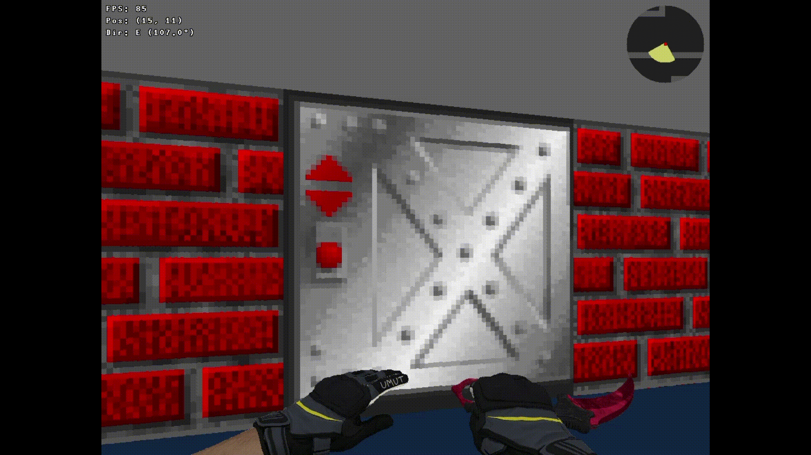

# 🎮 Cub3D

*A powerful 3D raycasting engine - bringing classic FPS graphics to life*

---

## 📖 Introduction

Cub3D is a sophisticated 3D raycasting engine implemented in C using MinilibX. This project demonstrates advanced graphics programming through mathematical ray projection algorithms, recreating the legendary rendering technique that powered classic games like Wolfenstein 3D. Built with performance and precision in mind, cub3D transforms 2D maps into immersive 3D worlds.

## ✨ Features

### Core Rendering Engine
- **Raycasting Algorithm**: Mathematical ray projection for real-time 3D wall rendering
- **Textured Surfaces**: Dynamic wall textures with directional mapping (North, South, East, West)
- **Interactive Elements**: Smooth door mechanics and sprite rendering system
- **Performance Optimization**: Efficient rendering pipeline with minimal computational overhead

### Advanced Graphics Features
- **Real-time Minimap**: Live 2D overhead view with dynamic player tracking
- **Custom Map Parser**: Robust `.cub` file format with comprehensive validation
- **Smooth Controls**: Fluid player movement and camera rotation mechanics
- **Mouse Movement (Pitch & Yaw)**: Intuitive camera control with horizontal (yaw) and vertical (pitch) rotation using mouse movement
- **Visual Effects**: Proper depth perception and texture mapping

## 🎥 Showcase

Here are some highlights of Cub3D:

<p float="left">
  <figure>
    
    <figcaption><b>Doors in Action</b> – Smooth open & close transitions</figcaption>
  </figure>

<!--

  <figure>
    
    <figcaption><b>Mouse-Controlled Camera</b> – Fluid camera rotation</figcaption>
  </figure>
</p>

-->

<p float="left">
  <figure>
    
    <figcaption><b>Real-time Minimap</b> – Dynamic player tracking</figcaption>
  </figure>
</p>

## 🛠️ Installation & Setup

### Prerequisites
- GCC compiler
- Make utility
- Linux with X11 support

### Required Packages
```bash
sudo apt-get update
sudo apt-get install libx11-dev libxext-dev gcc make
```

### Quick Start
```bash
# Clone and build
git clone git@github.com:melmut-42/cub3D.git
cd cub3D
make

# Run the engine
./cub3D maps/valid/example.cub
```

The build process automatically:
1. Compiles MinilibX graphics library
2. Builds custom libft utility library  
3. Links all components with proper dependencies

## 🗺️ Map Configuration

Map files use `.cub` extension with precise configuration syntax:

```
NO ./textures/north_wall.xpm
SO ./textures/south_wall.xpm
WE ./textures/west_wall.xpm
EA ./textures/east_wall.xpm
F 220,100,0
C 225,230,220

111111111111
100000000001
101000000001
100000N00001
111111111111
```

### Configuration Elements
| Element | Purpose | Format |
|---------|---------|---------|
| `NO/SO/WE/EA` | Wall textures for cardinal directions | Path to `.xpm` file |
| `F` | Floor color | RGB values (0-255) |
| `C` | Ceiling color | RGB values (0-255) |
| `0` | Empty space | Walkable area |
| `1` | Wall | Solid barrier |
| `N/S/E/W` | Player spawn | Starting position and orientation |

## 🎮 Controls

| Key             | Action            |
|------------------|-------------------|
| `W/A/S/D`        | Traverse           |
| `↑/↓/←/→`        | Rotate camera      |
| `Mouse Move`     | Look around        |
| `SPACE`          | Jump               |
| `E`              | Interact           |
| `SHIFT`          | Sprint             |
| `CTRL`           | Crouch             |
| `ESC`            | Exit game          |

## 🚀 Usage Examples

```bash
# Launch with example map
./cub3D maps/valid/example.cub

# Test with different configurations
./cub3D maps/valid/large_maze.cub
./cub3D maps/valid/doors_demo.cub
```

## 🛡️ Robustness & Error Handling

cub3D gracefully manages edge cases including:
- Malformed map configurations and invalid texture paths
- Memory allocation failures and resource cleanup
- Invalid player positions and map boundary validation
- Graphics initialization errors and window management
- Complex file parsing scenarios with comprehensive validation

## ⚡ Technical Highlights

This implementation showcases advanced programming concepts:
- **Computer Graphics**: Mathematical raycasting algorithms and texture mapping
- **Memory Management**: Efficient allocation strategies with zero leaks
- **File Processing**: Robust parsing with comprehensive error handling
- **Event-Driven Programming**: Real-time input processing and rendering loops
- **Mathematical Optimization**: Trigonometric calculations and vector mathematics

## 🛠️ Troubleshooting

### Common Issues
- **MinilibX compilation**: Ensure X11 development headers are installed
- **Display errors**: Verify `$DISPLAY` environment variable for remote sessions
- **Texture loading**: Check file permissions and XPM format validity
- **Memory issues**: Run with valgrind for detailed debugging

---

**Built with mathematical precision and graphics programming excellence.**

*"Where mathematics meets visual artistry in the realm of computer graphics."*
